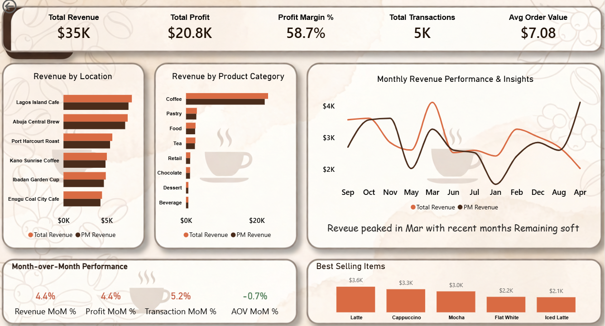

# ☕ Cafe Performance & Revenue Analytics Dashboard

An end-to-end business intelligence project utilizing **SQL** and **Power BI** to analyze revenue, operational efficiency, and product sales performance for a multi-location cafe franchise.



## 📌 Project Overview
This project transforms raw transactional data into an interactive executive dashboard. The primary goal is to empower regional managers and stakeholders with clear, actionable insights regarding sales trends, location profitability, product demand, and month-over-month growth patterns.

## 📊 Key Insights & Business Value
* **Revenue Breakdown:** Generated **$35K** in total revenue with a highly efficient **58.7% profit margin**, resulting in a net profit of **$20.8K**.
* **Product Performance:** Identified that while the broad "Coffee" category dominates volume, granular tracking reveals the **Latte ($3.6K)** and **Cappuccino ($3.3K)** as the top individual asset drivers.
* **Location Rankings:** **Lagos Island Cafe** outpaced all other branches in sales volume, providing a benchmark operational model for lower-performing branches like *Enugu Coal City Cafe*.
* **Trend Analysis:** Identified major revenue peaks during the March cycle, followed by trailing stabilization phases, highlighting specific seasonal windows for target marketing.

## 🛠️ Tech Stack & Skills Highlighted
* **Power BI Desktop:** Dashboard architecture, visual design, and container grouping.
* **DAX (Data Analysis Expressions):** Time-intelligence calculations for Month-over-Month (MoM%) growth tracking and Previous Month (PM) performance metrics.
* **SQL:** Data manipulation, aggregations, and cleaning prior to loading.
* **UI/UX Design:** Developed a custom espresso-themed color palette (`#1F1107`, `#D96B43`, `#F6F0EA`) optimized for readability, visual hierarchy, and strategic color contrast.

## 📐 Data Model & Architecture
The dashboard incorporates key measures built to track relative changes over time:
* **Total Revenue:** Summation of gross item sales.
* **PM Revenue:** Time-shifted calculation capturing sales from the previous month period.
* **MoM Growth %:** Formatted variance calculation providing dynamic velocity indicators for performance.

## 📂 Repository Structure
```text
├── Data/                 # Raw dataset files (CSV/Excel)
├── SQL_Queries/         # SQL scripts utilized for initial cleaning & staging
├── Cafe_Dashboard.pbix  # The complete Power BI project file
└── README.md            # Project documentation
